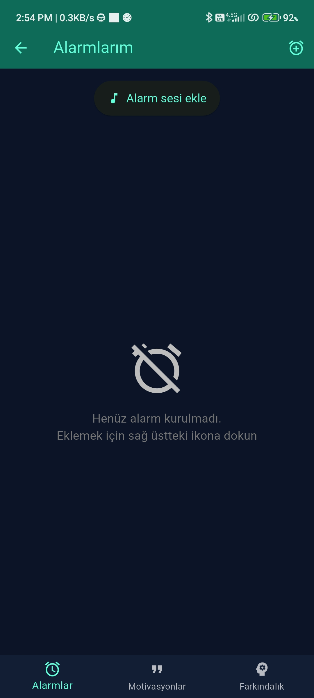
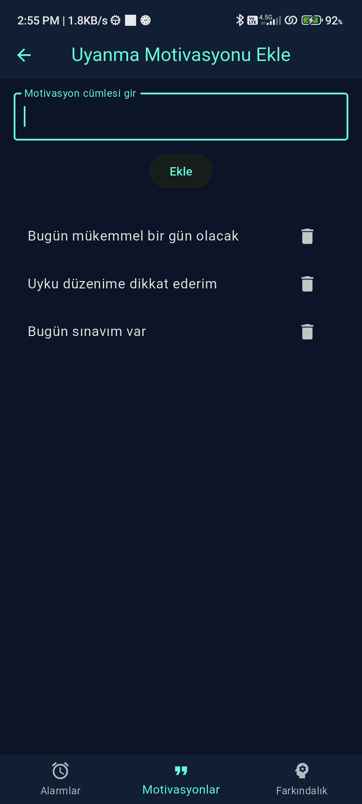
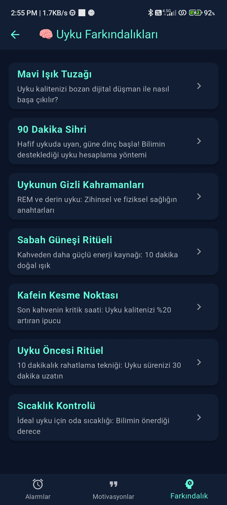
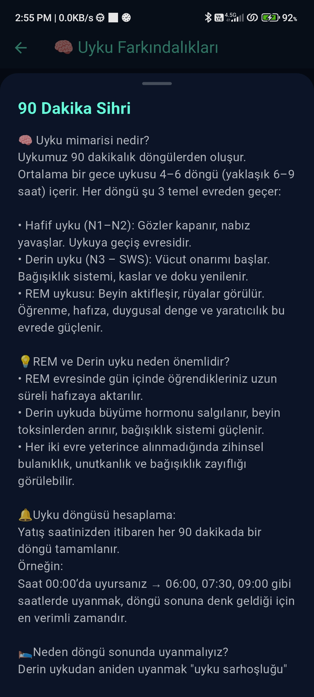
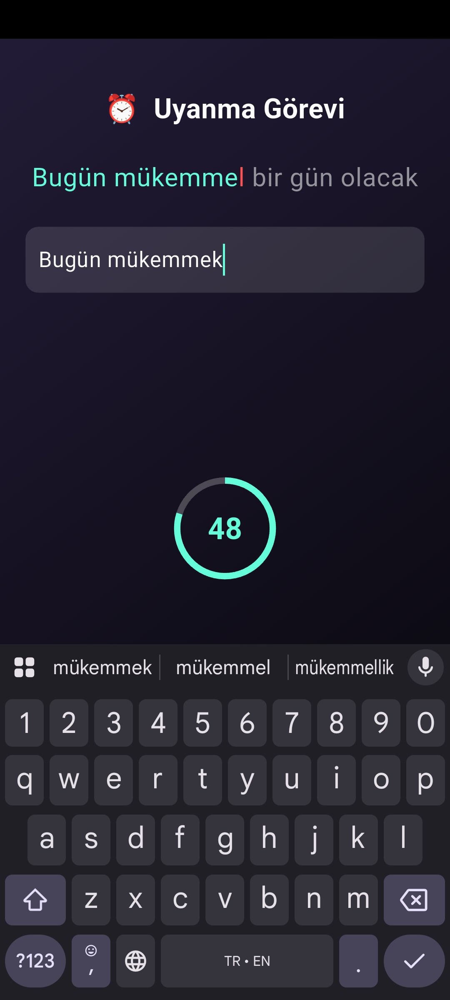

# ⏰ Flutter Alarm Uygulaması
Kullanıcıyı tek seferde uyandırmak için tasarlanmış, modern bir **alarm uygulaması**. **Erteleme tuşu içermeyen** yapısı ve uyanma görevleriyle klasik alarm uygulamalarından ayrılır. Uygulamanın amacı sadece uyandırmak değil; aynı zamanda güne zihinsel olarak hazır başlamanı sağlamak.

## 🚀 Özellikler

- 🔔 **Alarm Kurma:** Tek seferlik veya tekrar eden alarmlar oluşturabilirsiniz.
- 📱 **Flutter ↔ Native Entegrasyonu:** Android sistem alarmı doğrudan native (Kotlin) kod ile tetiklenir.
- 🧠 **Uyanma Görevleri:** Alarmı kapatmak için kullanıcıyı zihinsel olarak aktif hâle getiren mini görevler:
    - Hafıza oyunu (kareleri ezberle ve bul)
    - Yazıları tekrar yaz (motivasyon cümlelerini eksiksiz yaz)
- 🗝️ **Tam Ekran Alarm:** Alarm çaldığında ekran uyanır ve doğrudan RingActivity (Kotlin) açılır.
- 🔐 **Firebase Authentication:** Kullanıcılar e‑posta ve şifre ile giriş yapabilir.
- 💭 **Motivasyon Sayfası:** Uygulama içinde düzenlenebilir motivasyon cümleleri saklanır.
- 🌙 **Uyku Farkındalığı Sayfası:** Uyku kalitesini artırmaya yönelik bilimsel bilgiler ve öneriler içerir.
- ✅ **İzin Kontrolü ve Yönlendirme:** Alarm çalışabilmesi için gerekli Android izinleri başta istenir.
- 🧠 **REM ve Derin Uyku Bilgilendirmesi:** Uykunun biyolojik döngüleri hakkında farkındalık sağlar.
- ☁️ **Firebase ile Veri Senkronizasyonu (opsiyonel):** Giriş yapan kullanıcılar farklı cihazlarda senkronize olabilir (geliştirmeye açık).

## 🔧 Kullanılan Teknolojiler

- **Flutter & Dart**
- **Kotlin (Native Android Alarm)**
- **Firebase (Authentication)**
- **Shared Preferences** (lokal veri saklama)
- **Flutter Local Notifications**
- **Permission Handler**
- **Android Alarm Manager Plus** (yalnızca örnekler için)

## 📲 Ekran Görüntüleri

### Ana Sayfa

### Motivasyon Ekleme

### Farkındalık Listesi

### Farkındalık Detayı

### Hafıza Oyunu

### Motivasyon Yazma Görevi

---
## 📌 Bilimsel Temelli Farkındalıklar
- Uygulama içeriği, uyku kalitesini artırmak ve sağlıklı alışkanlıklar kazandırmak için seçilmiş bilimsel öneriler içerir.
- Her içerik kısa bir özetle başlar, detay ekranında anlaşılır ve teknik bilgiler sunar.

## 🛠️ Kurulum

1. Firebase projesi oluştur ve Android'i ekle.
2. `google-services.json` dosyasını `android/app/` klasörüne yerleştir.
3. `flutter pub get` çalıştır.
4. Android telefon bağlayarak `flutter run`.

## 📁 Dizin Yapısı (Özet)
lib/
├── main.dart                 # Uygulama başlatıcısı, native handler’lar
├── motivation_page.dart     # Motivasyon listesi
├── motivation_typing_page.dart # Yazı yazma görevi
├── grid_memory_game_page.dart  # Hafıza oyunu
├── good_morning.dart        # Uyanış sonrası ekran
├── login_page.dart          # Giriş ekranı
├── awareness_page.dart      # Uyku farkındalığı sayfası
└── permission_screen.dart   # Android izinleri

## 🧪 Test Notları

- Alarm, Android 8+ cihazlarda test edilmiştir.
- Uygulama, kilit ekranında tam ekran açılabilmektedir.
- Firebase yapılandırması doğru yapılmazsa uygulama açılmaz, hata verir.

## 🔐 Kimlik Doğrulama
- Kullanıcı kayıtları Firebase Authentication ile tutulur.

- Yeni kullanıcılar mail/şifre ile kayıt olur, giriş yapabilir.

- Oturum açık kalır, uygulama açılışında kullanıcı durumuna göre yönlendirme yapılır.

## 📄 Lisans
Dilediğiniz gibi kullanabilir ve geliştirebilirsiniz.

---

## Hazırlayan: [Hüseyin Erekmen]
- https://github.com/husoelrey
- https://www.linkedin.com/in/huseyinerekmen/

